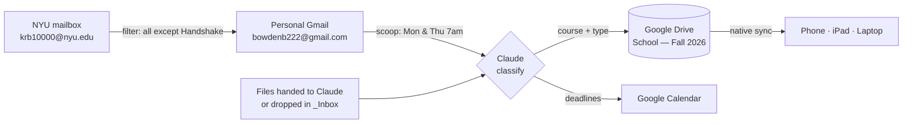

# Class & Assignment System — Fall 2026

**One-line:** Google Drive is the home for every class file; email flows in automatically from NYU; Claude classifies and files it; Calendar carries the deadlines.

Built 2026-08-10, before the term starts. Everything below is live unless flagged **OPEN**.

---

## 1. Why this exists

Four courses at NYU SPS starting September, across three devices (phone, iPad, laptop), with class material arriving as handouts, readings, and email — to an NYU mailbox separate from the personal one. The need wasn't a to-do list. It was **one place where the actual materials live**, sorted correctly, reachable anywhere.

---

## 2. How it works



Three ways material enters the system:

| Route | What happens |
|---|---|
| **Hand a file to Claude** in chat | Read, classified, renamed, filed. No duplicate. |
| **Drop into `_Inbox/`** | Say "file my inbox" — sorted into course folders. |
| **Email** | Arrives automatically via forwarding; scooped Mon & Thu. |

---

## 3. Courses

| Course | Code | Professor | Meets | Dates |
|---|---|---|---|---|
| BOM | BUSN1-UC 504 | Dukette | Thu 6:20–8:50 PM | Sep 3 – Dec 10 |
| Marketing | BUSN1-UC 943 | Rios | **OPEN** — TBA | Oct 22 – Dec 14 |
| Darwin to DNA | — | Tessler | Wed 4:55–7:25 PM | Sep 2 – Dec 9 |
| DAUS Seminar | — | Aznauryan | Mon 11:00 AM–1:30 PM | Sep 14 – Oct 19 |

Program: NYU SPS, Division of Applied Undergraduate Studies (DAUS).

---

## 4. Drive structure

**Root:** [School — Fall 2026](https://drive.google.com/drive/folders/1iQpM5LM4sXgcciB4_mY01L0cr9ZT1kub)

```
School — Fall 2026/
├── 📌 START HERE (how the system works)
├── _Inbox/                    ← drop zone for unsorted files
├── Admin & Advising/          ← program-level NYU mail (not course-specific)
├── BOM (BUSN1-UC 504)/
│   ├── Handouts/  Assignments/  Readings/  Exams/  Emails/
├── Marketing (BUSN1-UC 943)/  … same five
├── Darwin to DNA (Tessler)/   … same five
└── DAUS Seminar/              … same five
```

Five sections per course, every time:

- **Handouts** — slides, syllabi, lecture notes, reference sheets
- **Assignments** — problem sets, essays, projects (things turned in)
- **Readings** — chapters, articles, packets
- **Exams** — study guides, past exams, quiz info
- **Emails** — professor correspondence, saved for the record

**Naming convention:** `CODE — Type — Topic — YYYY-MM-DD`
Example: `BOM — Handout — Break-even analysis — 2026-09-17`

Sorts chronologically inside a type, searchable by course code, unambiguous a year later.

---

## 5. Email pipeline

**The problem:** class email goes to the NYU mailbox, which Claude cannot read. Only the personal Gmail is connected.

**The fix:** a Gmail filter on the NYU account forwards **everything except Handshake** to the personal Gmail.

- Filter criteria: `-from:joinhandshake.com` (in the *Doesn't have* field)
- Actions: **Forward to** `bowdenb222@gmail.com` + **Never send it to Spam**
- Blanket forwarding is left **off** — only a filter can carry an exclusion.

**Verified working 2026-08-10** — a Registrar email addressed to the NYU account landed in the personal inbox and was filed successfully.

### The automated scoop

| | |
|---|---|
| **Schedule** | Mondays & Thursdays, 7:00 AM Eastern |
| **Trigger ID** | `trig_01Y3ZWRJbogEqrkhYbRLW4kA` |
| **Cron (UTC)** | `0 11 * * 1,4` |
| **Binding** | Fires into the originating Claude session (holds the connectors) |

Each run: search the last ~5 days for course/NYU mail → ignore job alerts, promos, loan spam, Handshake → file keepers into the right course's `Emails/` → add stated deadlines to Calendar → summarize.

Timing is deliberate: Monday is DAUS Seminar, Thursday is BOM — the sweep lands before each.

**Manual override:** say *"scoop my email"* anytime.

---

## 6. Calendar

Class schedule was already in Google Calendar and was **left untouched** — no duplicate class events were created. Calendar is used only for **deadlines and obligations** surfaced from filed material.

Currently set:
- **Re-file NYU VA Benefits Form (Spring 2027)** — Oct 26, 2026, all-day, marked Free. Email reminder the day before + morning popup. Contains the form link, filing checklist, and contacts.

---

## 7. Design decisions worth remembering

**Google Drive, not a custom app.** A single-file HTML tracker was built first (`tracker.html`) — a real dashboard with overdue/due-today counts, filtering, and `.ics` export. It was superseded because **browser `localStorage` doesn't sync across devices**. Kept in the repo as a local-only option.

**Why not just host the HTML file on Drive?** Two reasons: Google Drive stopped serving live websites in 2016 (it previews/downloads, JavaScript never runs), and more fundamentally — **the file is the program, not the data**. Syncing the file across three devices produces three empty apps with three unconnected datasets. What has to be shared is the *data source*, which is what Drive and Calendar already are.

**`Admin & Advising/` exists** because program-level NYU mail (advising, orientation, bursar, registrar, financial aid) belongs to no single course. Filing it under "DAUS Seminar" would conflate the division with the class of the same name.

**Forward, don't connect.** Connecting the NYU Google account directly was the alternative; university Workspace tenants frequently block third-party access. Forwarding sidesteps the whole question and needs no IT permission.

---

## 8. Gotchas

- **Drive tools copy, they don't move.** A file already in Drive gets a correctly-named *copy* filed into the course folder; the original stays put. Files handed to Claude in chat are placed cleanly with no duplicate.
- **Gmail refuses to forward a message back to its own sender.** A test sent *from* the personal Gmail *to* NYU can never forward — that's loop protection, not a broken filter. Test from a third address.
- **Forwarding requires clicking the confirmation link** Google emails to the destination. Until then, nothing forwards at all.
- **Attachments can't be pulled from Gmail directly** — but when an email links a shareable Drive file, that real file can be copied in (this is how the DAUS New Student Guide PDF was captured).
- **DST shift:** after Nov 2, 2026, the cron `0 11` becomes 6:00 AM Eastern. Needs changing to `0 12 * * 1,4` to hold 7:00 AM.

---

## 9. Open loops

- [ ] **Marketing (BUSN1-UC 943)** — day/time still TBA, not yet posted
- [ ] **First automated scoop run** — verify the scheduled session actually reaches Gmail/Drive. If it can't, rebuild the Routine from the claude.ai Routines UI where connectors attach explicitly
- [ ] **Spring 2027 registration date** — Oct 26 reminder is an *estimate* ahead of NYU's usual early/mid-November window; move it once the Albert enrollment appointment posts
- [ ] **Professors' actual email addresses** — scoop query currently matches on surnames + `@nyu.edu`; tighten once real addresses are known
- [ ] **DST cron shift** after Nov 2
- [ ] Confirm a real Handshake email does *not* forward through

---

## 10. Already filed

In `Admin & Advising/`:

| Document | Date |
|---|---|
| DAUS New Student Guide (PDF, 664 KB) | — |
| VA Benefits Certification Confirmed (Fall 2026) | 2026-08-10 |
| Fall 2026 Welcome & Orientation (Aug 30 – Sep 1) | 2026-07-09 |
| DAUS Scholarship Decision Available | 2026-06-25 |
| Onboarding Checklist ("What You Need To Know") | 2026-05-18 |
| Advising Meeting Prep (Chloe Rappe) | 2026-04-30 |

Course `Emails/` folders are empty by design — no course mail exists until the term starts.

---

## 11. Repo

`bowdenb222/hello-world` → branch `claude/class-assignment-tracker-6fdg4n`

| File | Purpose |
|---|---|
| `school-filing-system.json` | Machine-readable folder map — course keys, instructors, meeting times, every Drive folder ID. This is what lets a future session file correctly. |
| `tracker.html` | Standalone offline dashboard (local-only, superseded) |
| `TRACKER.md` | Guide for the local tracker |
| `CLASS-SYSTEM-REFERENCE.md` | This document |

---

## 12. Operating it

**Daily:** nothing required. Material arrives and gets filed.

**When something lands:** hand the file to Claude, or drop it in `_Inbox/`.

**Useful phrasings:**
- *"scoop my email"* — sweep now instead of waiting for Mon/Thu
- *"file my inbox"* — sort whatever is sitting in `_Inbox/`
- *"what's due this week?"* — read back from Calendar + filed material

**Weekly (suggested, Sunday):** glance at the week ahead, confirm nothing in `_Inbox/` is stranded.

---

## Key identifiers

| Thing | Value |
|---|---|
| Drive root | `1iQpM5LM4sXgcciB4_mY01L0cr9ZT1kub` |
| `_Inbox` | `1On4oKFv_b0qo2aETrNcKewl-j3x3K7vw` |
| `Admin & Advising` | `1uEcjH4ke-FO96qITU3iyo-P9DK62nuV1` |
| BOM · Emails | `1ko_LW49XRzRinr6fLM3QmtyG8AXQgEgP` |
| Marketing · Emails | `1g3v4yeX8sXBgTVNYrbUiM6vbVvYodw5x` |
| Darwin to DNA · Emails | `1d4_oXoy_FyQSSbiSJ_JzJP8pzzUN_ITI` |
| DAUS Seminar · Emails | `12kyB73R5Tpt4l05puyDgScYnwMvgowr2` |
| Scoop Routine | `trig_01Y3ZWRJbogEqrkhYbRLW4kA` |

Full folder map (including Handouts/Assignments/Readings/Exams per course) lives in `school-filing-system.json`.
